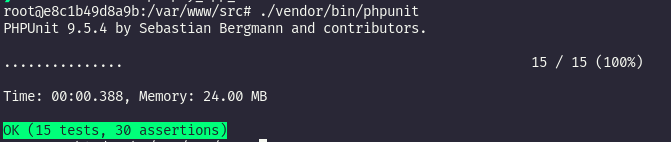

# Transfer Money

API que permite o cadastro de logistas e clientes. Transferências de cliente para cliente e cliente para logista
## 💻 Pré-requisitos

Antes de começar, verifique se você atendeu aos seguintes requisitos:
<!---Estes são apenas requisitos de exemplo. Adicionar, duplicar ou remover conforme necessário--->
* Você tem instalado em seu computador `<docker / docker-compose >`
## 🚀 Instalando Transfer Money

Para executar, siga estas etapas:

Clone o repositório: 
```
git clone https://github.com/newton-peixoto/transfer_money.git
```

Entre na pasta do projeto:
```
cd transfer_money
```

Suba os containers:
```
docker-compose up -d
```
## ☕ Utilizando Transfer Money

Uma vez com a aplicação pronta, você poderá acessar http://localhost:8000 e verificar que está tudo funcionando. Após isso poderá importar e testar todas as rotas disponíveis em [doc](docs/transfer_money.postman_collection.json) 

 * Cadastro com CNPJ -> logista 
 * Cadastro com CPF  -> cliente comum

## 🤝  Testando a aplicação

Entre no container :
```
docker exec -it transfer_money_app_1 bash
```
Execute os testes : 
```
./vendor/bin/phpunit
```
Deverá visualizar: 

